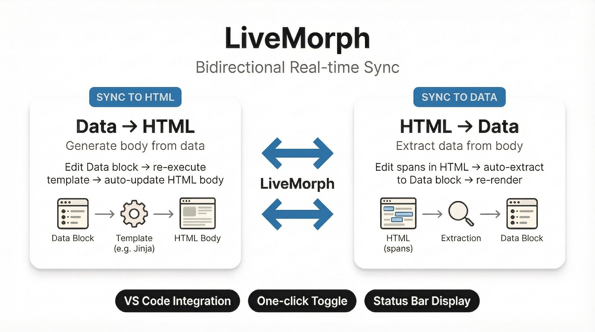

# gospelo-kata — KATA Markdown™ for Human-AI Collaboration

[](https://github.com/gospelo-dev/kata/blob/main/LICENSE.md)
[](https://www.python.org/)
[](#why-gospelo-kata)
[](#kata-markdown-format)

A document format and toolkit designed for **human-AI collaboration**. KATA Markdown™ embeds schema, data, and template in a single file — readable and actionable by both humans and AI without special instructions.

## Why gospelo-kata?

When generating documents with AI, you often face problems: no structure, no round-trip, no validation, and AI needs coaching every time. gospelo-kata solves this with a **single `.kata.md` file** that contains schema definition, structured data, and a Jinja2-compatible template.

## LiveMorph — Bidirectional Real-time Sync

<p align="center">
  
</p>

Bidirectional sync between Data blocks and HTML body. Switch modes with **one click** from VS Code, with the current sync mode always visible in the status bar.

## Human-AI Readable — Self-Describing Format

Embedded `**Schema**` and `**Prompt**` blocks let AI understand the template without external instructions. Humans read and edit the same file naturally. The `build` command means AI only needs to generate YAML data.

## Secure Packaging — KATA ARchive™ (.katar)

Bundle template, schema, and prompt into a ZIP archive. SHA-256 integrity verification, file-type sandboxing, and AI prompt trust management included.

## Installation

```bash
pip install gospelo-kata

# With Excel support
pip install gospelo-kata[excel]
```

Requires Python 3.11+.

## Quick Start

```bash
# List available templates
gospelo-kata templates

# Generate .kata.md with built-in sample data
gospelo-kata build todo -o ./

# Edit the Data block → update body
gospelo-kata sync to-html todo.kata.md

# Validate
gospelo-kata lint todo.kata.md
```

## Built-in Templates

| Type | Description |
|------|-------------|
| `checklist` | Structured checklist with categories and status tracking |
| `test_spec` | Test case specification with prerequisites and expected results |
| `agenda` | Meeting agenda with decisions and action items |
| `storyboard` | Scripted scene with characters, cuts, dialogue, and bundled avatar + cut images |

See the [full template list](https://github.com/gospelo-dev/kata/blob/main/docs/manual/en/templates.md) for every built-in template (security testing, load, infra, etc.).

## CLI Commands

| Command | Description |
|---------|-------------|
| `templates` | List available templates |
| `init` | Initialize project from a template |
| `render` | Render template to annotated output |
| `assemble` | Combine built-in template + data into `_tpl.kata.md` |
| `build` | Generate .kata.md from template (data arg optional) |
| `lint` | Validate templates and rendered documents |
| `extract` | Extract structured data from rendered output |
| `validate` | Validate data against a schema |
| `pack` / `pack-init` | Create `.katar` archives |
| `export` | Export template parts |
| `import-data` | Validate data.yml against schema |
| `sync` | LiveMorph bidirectional sync (`to-html` / `to-data`) |

See the [CLI Reference](https://github.com/gospelo-dev/kata/blob/main/docs/manual/en/cli-reference.md) for details.

## VSCode Extension

Install from [VS Marketplace](https://marketplace.visualstudio.com/items?itemName=gospelo.kata-lint):

- Real-time lint (Problems panel)
- LiveMorph sync (context menu / status bar)
- Hover info for `data-kata` attributes
- Preview CSS for kata styles

## Documentation

- [Quick Start](https://github.com/gospelo-dev/kata/blob/main/docs/manual/en/quick-start.md)
- [CLI Reference](https://github.com/gospelo-dev/kata/blob/main/docs/manual/en/cli-reference.md)
- [KATA Markdown™ Format](https://github.com/gospelo-dev/kata/blob/main/docs/manual/en/kata-markdown-format.md)
- [LiveMorph Guide](https://github.com/gospelo-dev/kata/blob/main/docs/manual/en/livemorph.md)
- [Templates](https://github.com/gospelo-dev/kata/blob/main/docs/manual/en/templates.md)
- [KATA ARchive Package](https://github.com/gospelo-dev/kata/blob/main/docs/manual/en/katar.md)
- [VSCode Extension](https://github.com/gospelo-dev/kata/blob/main/docs/manual/en/vscode.md)
- [Lint Rules](https://github.com/gospelo-dev/kata/blob/main/docs/manual/en/lint-rules.md)

## License

MIT — free for commercial use. Documents and templates you create are yours. See [LICENSE.md](https://github.com/gospelo-dev/kata/blob/main/LICENSE.md) for details.
