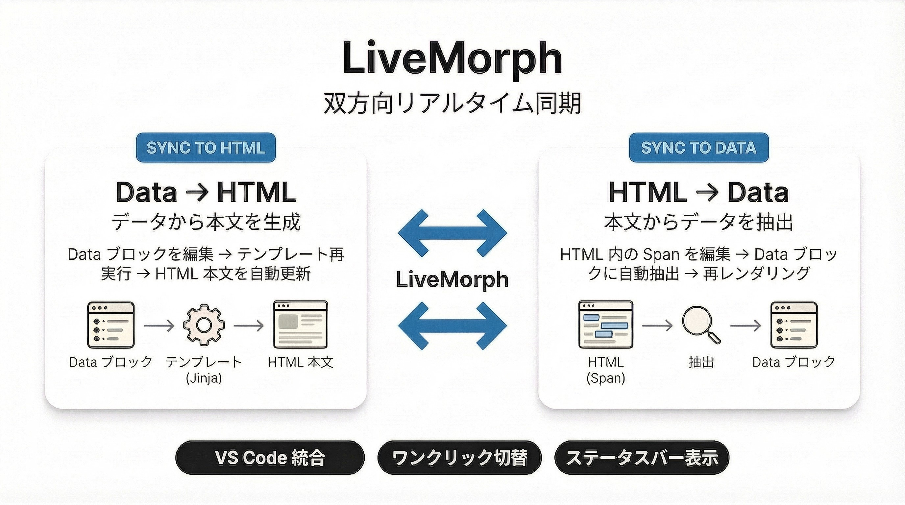

# gospelo-kata — KATA Markdown™ for Human-AI Collaboration

[](https://github.com/gospelo-dev/kata/blob/main/LICENSE.md)
[](https://www.python.org/)
[](#なぜ-gospelo-kata)
[](#kata-markdown-フォーマット)

**人間と AI の協同作業**のために設計されたドキュメントフォーマットおよびツールキットです。スキーマ・データ・テンプレートを1つのファイルに統合し、人間にも AI にも読み書きできるフォーマットです。

## なぜ gospelo-kata？

AI でドキュメントを生成する際、構造がない・ラウンドトリップできない・バリデーションがない・毎回指示が必要、といった問題があります。gospelo-kata は **単一の `.kata.md` ファイル** にスキーマ定義・構造化データ・テンプレートを統合し、これらを解決します。

## LiveMorph — 双方向リアルタイム同期

<p align="center">
  
</p>

Data ブロックと HTML 本文を双方向に同期。VS Code 拡張から **ワンクリック** で切り替え、ステータスバーで現在の同期モードを常時確認できます。

## Human-AI Readable — 自己記述的フォーマット

埋め込みの `**Schema**` と `**Prompt**` ブロックにより、AI は外部の指示なしでテンプレートを理解。人間も同じファイルを自然に読み書きできます。`build` コマンドで AI は YAML データのみ生成すれば OK。

## Secure Packaging — KATA ARchive™ (.katar)

テンプレート・スキーマ・プロンプトを ZIP アーカイブとして一括格納。SHA-256 ハッシュによる整合性検証、ファイル種別サンドボックス、AI プロンプトの信頼管理を提供します。

## インストール

```bash
pip install gospelo-kata

# Excel 出力サポート付き
pip install gospelo-kata[excel]
```

Python 3.11+ が必要です。

## クイックスタート

```bash
# テンプレート一覧
gospelo-kata templates

# 初期値で .kata.md を生成
gospelo-kata build todo -o ./

# Data ブロックを編集 → 本文に反映
gospelo-kata sync to-html todo.kata.md

# 検証
gospelo-kata lint todo.kata.md
```

## 組み込みテンプレート

| タイプ | 説明 |
|--------|------|
| `checklist` | カテゴリ・ステータス追跡付きチェックリスト |
| `test_spec` | 前提条件と期待結果を含むテストケース仕様書 |
| `agenda` | 決定事項・アクションアイテム付き会議アジェンダ |
| `storyboard` | 登場人物・カット・セリフを扱う絵コンテ(キャラクターアバター・カット画像を同梱)|

全ビルトインテンプレート(セキュリティテスト・ロード・インフラ等)は[テンプレート一覧](https://github.com/gospelo-dev/kata/blob/main/docs/manual/ja/templates.md)を参照。

## CLI コマンド一覧

| コマンド | 説明 |
|----------|------|
| `templates` | テンプレート一覧 |
| `init` | テンプレートからプロジェクトを初期化 |
| `render` | テンプレートをアノテーション付きでレンダリング |
| `assemble` | 組み込みテンプレート + データを `_tpl.kata.md` に結合 |
| `build` | テンプレートから .kata.md を生成 (data 省略時は内蔵データ使用) |
| `lint` | テンプレートとレンダリング出力を検証 |
| `extract` | レンダリング出力から構造化データを抽出 |
| `validate` | データをスキーマに対して検証 |
| `pack` / `pack-init` | `.katar` アーカイブの作成 |
| `export` | テンプレートパートの抽出 |
| `import-data` | data.yml をスキーマで検証 |
| `sync` | LiveMorph 双方向同期 (`to-html` / `to-data`) |

詳細は [CLI リファレンス](https://github.com/gospelo-dev/kata/blob/main/docs/manual/ja/cli-reference.md) を参照。

## VSCode 拡張機能

[VS Marketplace](https://marketplace.visualstudio.com/items?itemName=gospelo.kata-lint) からインストール:

- リアルタイム lint (Problems パネル)
- LiveMorph 同期 (コンテキストメニュー / ステータスバー)
- `data-kata` 属性のホバー情報
- kata 専用プレビュー CSS

## ドキュメント

- [クイックスタート](https://github.com/gospelo-dev/kata/blob/main/docs/manual/ja/quick-start.md)
- [CLI リファレンス](https://github.com/gospelo-dev/kata/blob/main/docs/manual/ja/cli-reference.md)
- [KATA Markdown™ フォーマット](https://github.com/gospelo-dev/kata/blob/main/docs/manual/ja/kata-markdown-format.md)
- [LiveMorph ガイド](https://github.com/gospelo-dev/kata/blob/main/docs/manual/ja/livemorph.md)
- [テンプレート一覧](https://github.com/gospelo-dev/kata/blob/main/docs/manual/ja/templates.md)
- [KATA ARchive パッケージ](https://github.com/gospelo-dev/kata/blob/main/docs/manual/ja/katar.md)
- [VSCode 拡張](https://github.com/gospelo-dev/kata/blob/main/docs/manual/ja/vscode.md)
- [Lint ルール一覧](https://github.com/gospelo-dev/kata/blob/main/docs/manual/ja/lint-rules.md)

## ライセンス

MIT — 商用利用を含め自由に利用できます。生成したドキュメントやユーザー作成テンプレートの著作権はユーザーに帰属します。詳細は [LICENSE_ja.md](https://github.com/gospelo-dev/kata/blob/main/LICENSE_ja.md) を参照。
