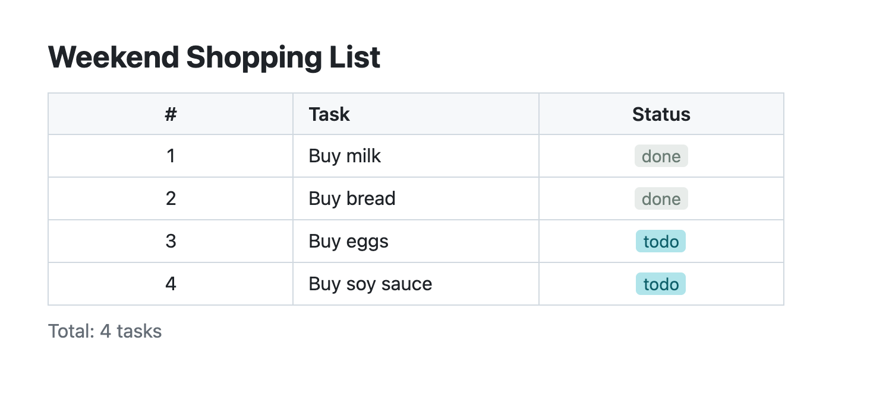
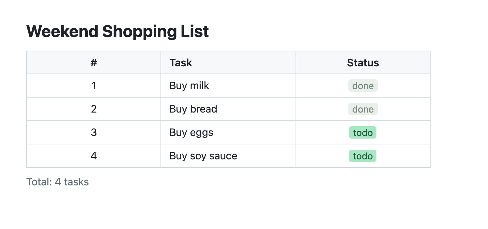
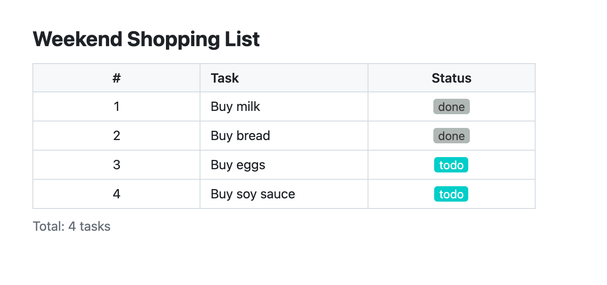
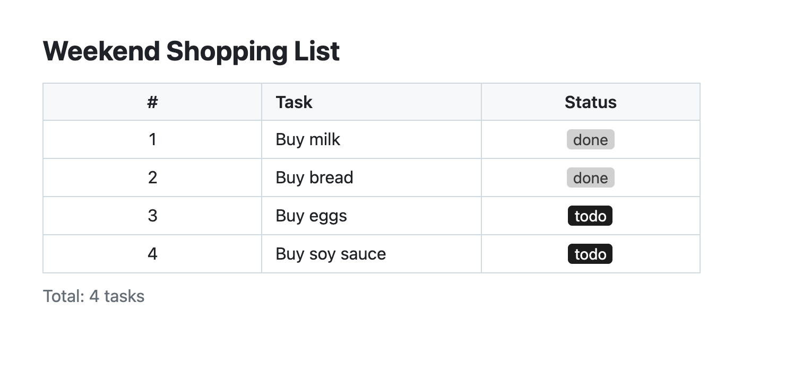

# Color Scheme Examples

Comparison of 5 built-in color schemes using the `todo` template.

Color palettes are based on the [Chart Banana](https://github.com/gospelo-dev/chart-banana) theme color system.

## Gallery

### default — Asagi

Clean light-blue tones on white background



### pastel — Jelly Mint

Mint green + dusty rose



### vivid — Vivid Gradient

High-contrast purple + cyan



### monochrome — Sumi-ink

Ink-wash monochrome + crimson accent



### ocean — Blue Aura

Blue-grey + terracotta


## How to set a color scheme

Specify `colorScheme` in the **Style** block inside the Specification section:

```yaml
colorScheme: vivid
```

You can also customize semantic role mapping for enum values with `enumColors`:

```yaml
colorScheme: vivid
enumColors:
  status:
    todo: neutral
    done: positive
    blocked: negative
```

If omitted, `default` is applied.

## Regenerating samples

```bash
# 1. Build base document
gospelo-kata build todo data.yml -o todo_vivid.kata.md

# 2. Add a Style block inside the Specification section (edit manually)

# 3. Re-render with sync
gospelo-kata sync todo_vivid.kata.md -o todo_vivid.kata.md
```

## Shared data

`data.yml` — TODO list data shared by all samples.
