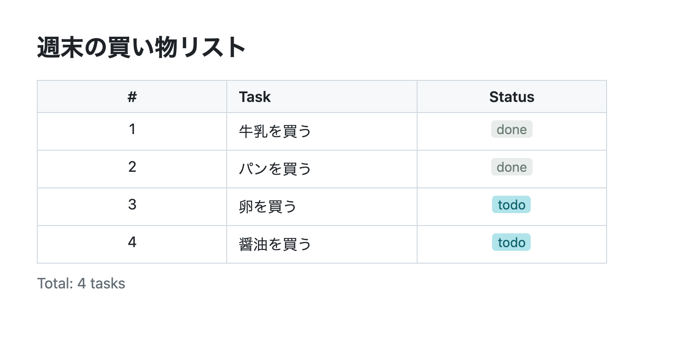
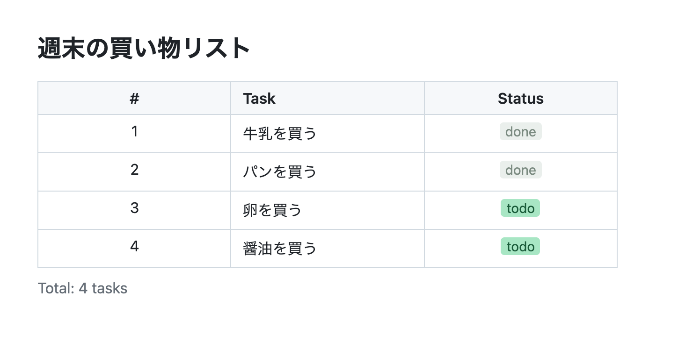
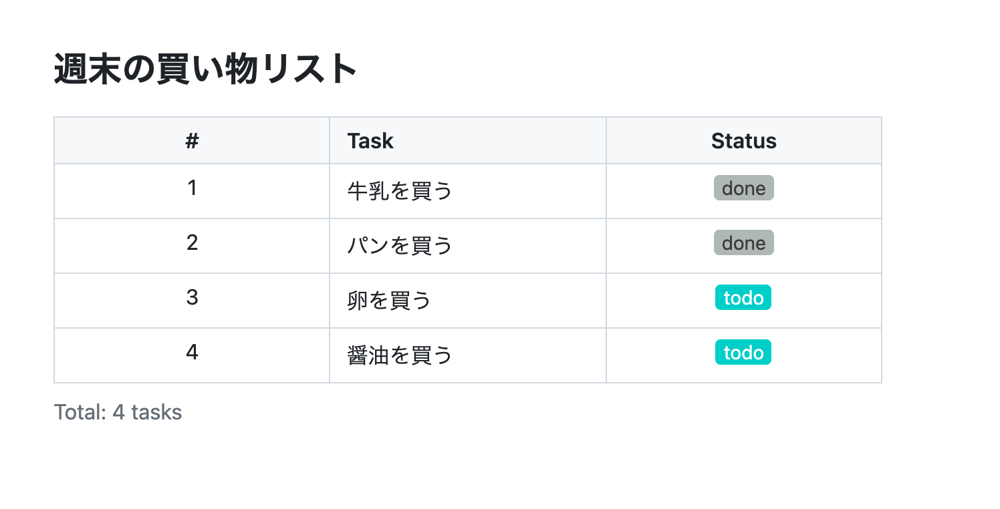
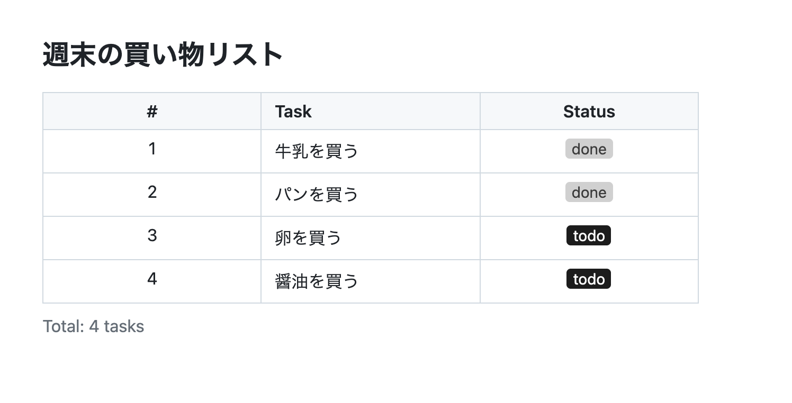
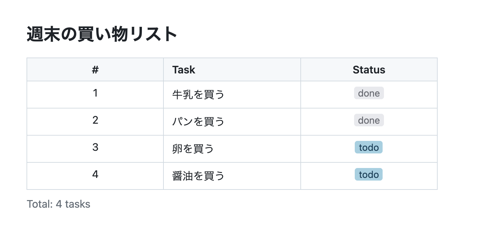

# カラースキーマ サンプル

ビルトインテンプレート `todo` を使った、5種類のカラースキーマの比較サンプルです。

カラーパレットは [Chart Banana](https://github.com/gospelo-dev/chart-banana) のテーマカラーシステムに基づいています。

## ギャラリー

### default — Asagi

澄んだライトブルー系、白背景



### pastel — Jelly Mint

ミントグリーン＋ダスティローズ



### vivid — Vivid Gradient

パープル＋シアンの高コントラスト



### monochrome — 墨 Sumi-ink

水墨画風モノクロ＋紅アクセント



### ocean — Blue Aura

ブルーグレー＋テラコッタ



## カラースキーマの指定方法

Specification 内の **Style** ブロックで `colorScheme` を指定します:

```yaml
colorScheme: vivid
```

enum 値のセマンティックロールをカスタマイズする場合は `enumColors` も指定できます:

```yaml
colorScheme: vivid
enumColors:
  status:
    todo: neutral
    done: positive
    blocked: negative
```

指定なしの場合は `default` が適用されます。

## サンプルの再生成

```bash
# 1. build でベースを生成
gospelo-kata build todo data.yml -o todo_vivid.kata.md

# 2. Specification 内に Style ブロックを追加（エディタで編集）

# 3. sync で再レンダリング
gospelo-kata sync todo_vivid.kata.md -o todo_vivid.kata.md
```

## 共通データ

`data.yml` — 全サンプル共通のTODOリストデータです。
